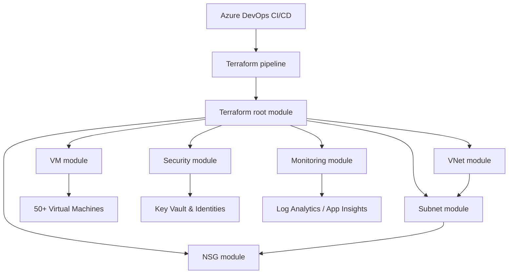

# Azure Enterprise Landing Zone

Reusable Terraform platform for enterprise-grade Azure deployments with multi-region, multi-environment support, scalable VM and network provisioning, centralized monitoring, IAM, policy enforcement, and Azure DevOps CI/CD.

## What this project delivers

- Multi-region hub/spoke network design
- Multi-environment support: `dev`, `test`, `stage`, `prod`
- Dynamic creation of 50+ VMs, VNets, subnets, NSGs, storage, and monitoring
- Centralized Azure Monitor + Log Analytics + Application Insights
- Managed identity and Key Vault security foundation
- Custom Azure Policy enforcement
- Remote backend with Azure Storage and state locking
- Azure DevOps pipeline with Validate → Security Scan → Plan → Approval → Apply
- Blue/Green deployment support via `blue_green_enabled`
- Cost optimization and tagging by environment

## Folder structure

- `main.tf` - root orchestration and module wiring
- `variables.tf` - reusable input configuration
- `locals.tf` - naming, tagging, and environment logic
- `provider.tf` - AzureRM provider configuration
- `versions.tf` - Terraform version and provider requirements
- `outputs.tf` - core outputs
- `modules/`
  - `vnet/` - virtual network module
  - `subnet/` - subnet module
  - `nsg/` - network security group module
  - `vm/` - VM provisioning module
  - `security/` - Key Vault and managed identity module
  - `monitoring/` - Log Analytics, App Insights, policy assignment module
- `environments/` - backend config for each environment
- `azure-pipelines.yml` - Azure DevOps CI/CD pipeline
- `terraform.tfvars.example` - sample configuration for 50 VM deployment

## Architecture overview



## Quick start

1. Install Terraform and Azure CLI.
2. Copy the example variables file:

   ```bash
   cp terraform.tfvars.example terraform.tfvars
   ```

3. Adjust the variables in `terraform.tfvars` for your subscription, regions, and deployment slot.
4. Initialize Terraform using environment-specific backend config:

   ```bash
   terraform init -backend-config=environments/dev/backend.tfbackend
   ```

5. Validate and plan:

   ```bash
   terraform validate
   terraform plan -var-file=terraform.tfvars
   ```

6. Apply:

   ```bash
   terraform apply -var-file=terraform.tfvars
   ```

## Environment strategy

This repository supports both:

- Environment folder backend strategy via `environments/<env>/backend.tfbackend`
- Terraform workspace strategy if preferred

Example using backend folder:

```bash
terraform init -backend-config=environments/prod/backend.tfbackend
terraform plan -var-file=terraform.tfvars
```

Example using workspaces:

```bash
terraform workspace new dev
terraform plan -var-file=terraform.tfvars
```

> Recommended: use the backend folder strategy for enterprise state separation and explicit backend config per environment.

## Blue/Green deployment support

Set these values in your `terraform.tfvars`:

```hcl
blue_green_enabled = true
deployment_slot = "blue"
```

Then deploy `blue` or `green` by changing `deployment_slot` in the variables file. Resource names automatically include the slot suffix for safe parallel deployments.

## Azure DevOps pipeline

The included `azure-pipelines.yml` defines the following stages:

1. Validate
2. Security Scan
3. Plan
4. Apply

The `Apply` stage uses an Azure DevOps environment with manual approval gates. Configure approval policies on the environment named `$(environment)-terraform` in Azure DevOps.

## Cost optimization tagging

Tags are automatically applied to all resources with:

- `Project`
- `Environment`
- `Owner`
- `CostCenter`
- `ManagedBy`
- `LandingZone`
- `DeploymentSlot`

Use these tags for chargeback, reporting, and Azure Cost Management filtering.

## Best practices

- Keep infrastructure changes declarative in `terraform.tfvars`
- Avoid hardcoded resource names outside of variable-driven naming
- Enforce least privilege on service connections and role assignments
- Store secret values in Azure Key Vault and Azure DevOps variable groups
- Run security scanners before plan/apply
- Promote changes through `dev -> test -> stage -> prod`

## Next steps

- Add dedicated subscription separation for hub and spoke workloads
- Extend policy definitions with management group-level controls
- Add Azure Firewall, Application Gateway, and WAF modules
- Add DAST testing for application workloads

## Notes

This repo is designed so future projects can be onboarded by changing only the `terraform.tfvars` file and backend configuration, while keeping module and pipeline code stable.
