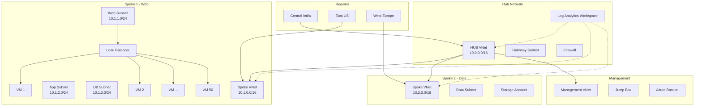

# Architecture Diagram

```mermaid
graph TB
    subgraph "Hub Network"
        HUB[HUB VNet<br/>10.0.0.0/16]
        GW[Gateway Subnet]
        FW[Firewall]
        LAW[Log Analytics Workspace]
    end

    subgraph "Spoke 1 - Web"
        SPOKE1[Spoke VNet<br/>10.1.0.0/16]
        WEB[Web Subnet<br/>10.1.1.0/24]
        APP[App Subnet<br/>10.1.2.0/24]
        DB[DB Subnet<br/>10.1.3.0/24]
        LB[Load Balancer]
        VM1[VM 1]
        VM2[VM 2]
        VM3[VM ...]
        VM50[VM 50]
    end

    subgraph "Spoke 2 - Data"
        SPOKE2[Spoke VNet<br/>10.2.0.0/16]
        DATA[Data Subnet]
        ST[Storage Account]
    end

    subgraph "Management"
        MGMT[Management VNet]
        JUMP[Jump Box]
        BAST[Azure Bastion]
    end

    subgraph "Regions"
        CIN[Central India]
        EUS[East US]
        WEU[West Europe]
    end

    HUB --> SPOKE1
    HUB --> SPOKE2
    HUB --> MGMT

    WEB --> LB
    LB --> VM1
    LB --> VM2
    LB --> VM3
    LB --> VM50

    LAW -.-> HUB
    LAW -.-> SPOKE1
    LAW -.-> SPOKE2

    CIN --> HUB
    EUS --> SPOKE1
    WEU --> SPOKE2
```